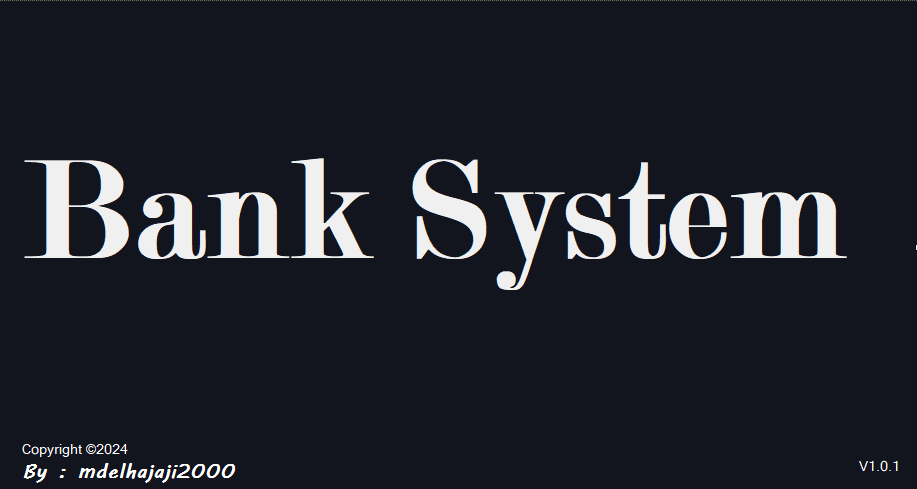
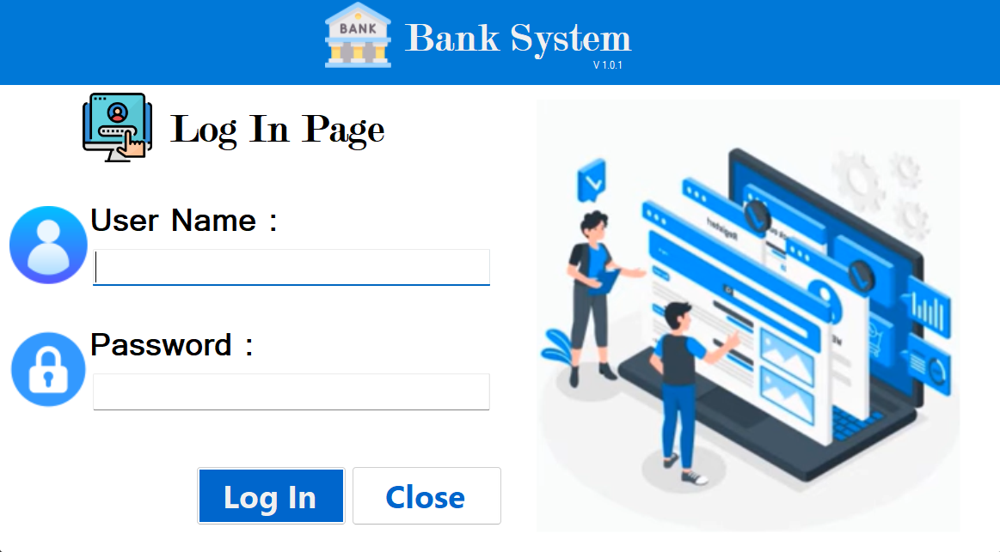
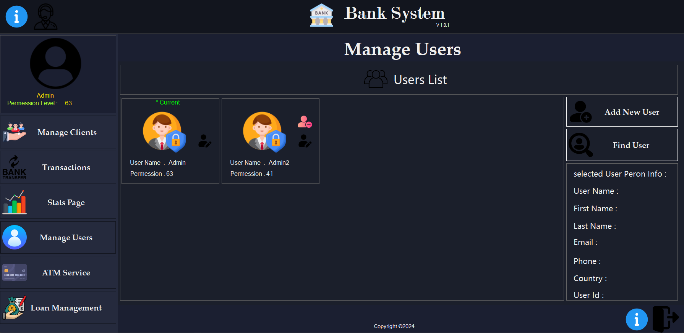
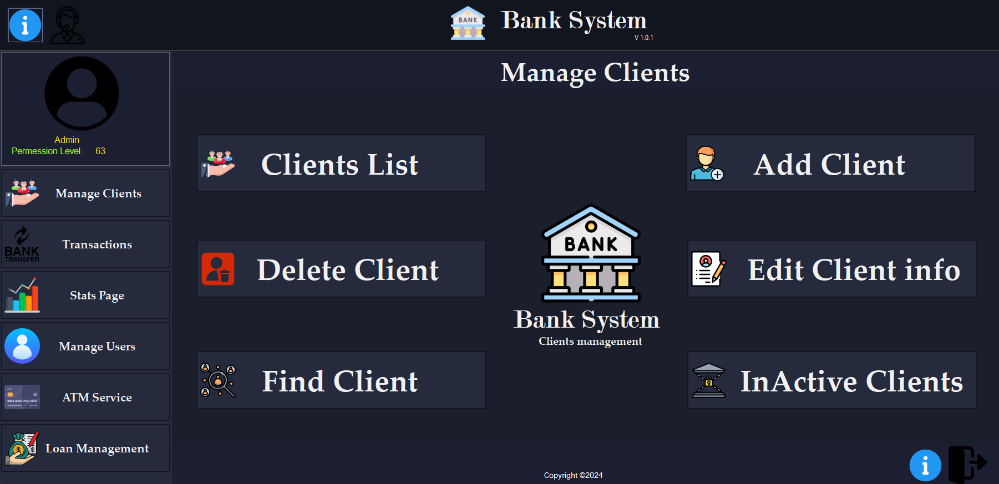

<div align="center">

</div>

# Bank System Application

### Progress
<div align="Center">
🔵🔵🔵🔵⚪⚪⚪⚪ 42%  [Not Completed...]
</div>

## Overview

The **Bank System Application** is a comprehensive desktop application designed to manage various banking operations efficiently. It features user management, client management, transaction handling, and more, making it suitable for small to medium-sized banks or financial institutions.

## Screenshots

### Login Page


### Manage Users Page


### Manage Clients Account`s



## Features

- **Login System**: Secure login interface for users with different permission levels.
- **User Management**: Admins can manage users, including adding new users, finding users, and setting permission levels.
- **Client Management**: Manage client information, accounts, and services.
- **Transactions**: Handle bank transactions with ease, including deposits, withdrawals, and transfers.
- **Statistics Page**: View detailed statistics and reports about the bank's operations.
- **ATM Service**: Interface for managing ATM-related operations.
- **Loan Management**: Manage loan applications, approvals, and repayments.
<!-- Installation Will Be Ready Whene The project Were Completed and Finished 
## Installation

1. **Clone the repository**:
    ```bash
    git clone https://github.com/yourusername/bank-system.git
    ```

2. **Navigate to the project directory**:
    ```bash
    cd bank-system
    ```

3. **Build the application**:
    Open the solution in Visual Studio and build the project.

4. **Run the application**:
    Execute the application from Visual Studio or navigate to the output directory and run the executable.

## Usage

- **Login**: Use your credentials to log in. Permissions determine the access level.
- **Manage Users**: Accessible only to users with admin permissions. Add, edit, or delete users.
- **Transactions**: Accessible to authorized users. Perform banking operations like deposits, withdrawals, and transfers.
- **Statistics**: View various reports and statistics related to banking operations.
- **Loan Management**: Handle loan-related activities, including application approval and monitoring repayments.

## Contributing

Contributions are welcome! Please fork the repository and create a pull request with your changes. Make sure to follow the coding conventions and include appropriate documentation.

## License

This project is licensed under the MIT License - see the [LICENSE](LICENSE) file for details.

## Contact

For any inquiries or support, please contact [Your Name] at [your.email@example.com].
-->
